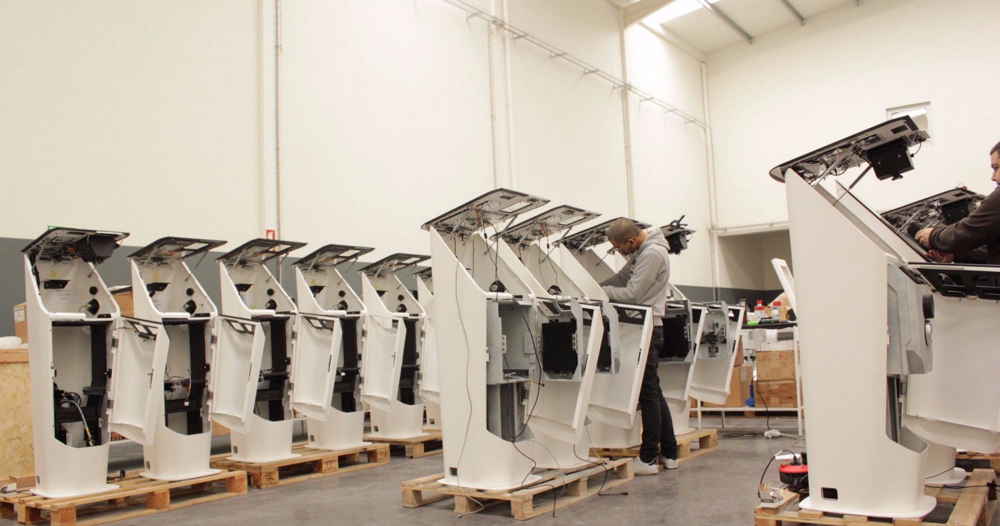

For years we’ve been searching for a home to call our own and we’ve finally found it in the majestic Swiss canton of Lucerne.

Crypto Valley is alive and kicking and we’re excited to be in an area so rich in crypto development and blockchain events. Although hype often exceeds reality in cryptoland, exciting stuff is happening in Switzerland at every level. Open source Bitcoin and Lightning Network nodes are being hacked together, hardware wallets are being designed and manufactured, the world’s leading cryptocurrency regulations are being carefully guided, world-class meetups and events are happening, and lots of Bitcoin ATMs are being deployed.

The cryptomat industry (aka Bitcoin ATMs) is booming and while we grow, we want to be in a place where rules are well defined and regulators are pro-innovation.

An example of this is our struggle to maintain a bank account over the past year. And when I say struggle, I mean we’ve been bankless for the past year. We must have been rejected by fifteen banks just because we manufacture terminals for Bitcoin. Note that as a company we only manufacture hardware and take no part in trading or storing cryptocurrencies.

Just as we arrived in Switzerland we had a nice chat with a small bank in Canton Aargau and now we have a full account at a bank that is completely aware of our business model and happy to have us on board. In fact, you should expect to see one of our cryptomats in their headquarters early this year.

The other day we were rejected by payment processor Stripe for having the word Bitcoin on our site. Perhaps had they been a Swiss company, this would not have happened and they would be able to embrace companies that experiment with innovative technologies.

We’re old-timers as far Bitcoin companies are concerned, but we’re psyched to be the new kids on the block here in stunning Lucerne.